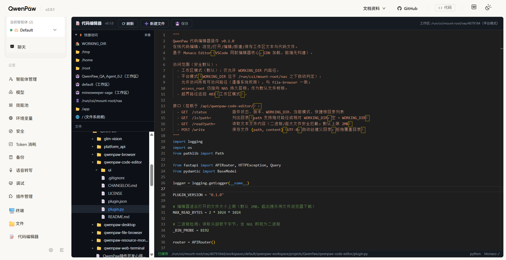

# 📝 代码编辑器（qwenpaw-code-editor）

基于 **Monaco Editor**（VSCode 同款编辑器核心）的 QwenPaw 在线代码编辑插件。



- 左侧文件树浏览目录（懒加载），点击文件在右侧打开编辑
- 按扩展名自动切换语法高亮（python / javascript / typescript / html / css / json / markdown / shell / go / rust / java / c/c++ 等 20+ 语言）
- **Ctrl+S** 保存（也可点工具栏保存按钮），未保存时显示 ● 标记
- 工具栏：刷新目录 / 新建文件 / 保存
- 深色主题（GitHub Dark 风格），与其它 QwenPaw 插件一致

## 安装

```bash
qwenpaw plugin install <项目路径> --force
```

安装后刷新平台页面，在 **应用 → 代码编辑器 📝** 打开。

> 首次打开需从 CDN（jsdelivr）加载 Monaco Editor（约 5MB），加载约 3~8 秒，
> 请确保浏览器可访问外网。加载失败时页面会给出明确提示。

## 使用

| 操作 | 方式 |
|---|---|
| 打开文件 | 点击左侧文件树中的文件 |
| 保存 | `Ctrl+S` 或工具栏 💾 保存 |
| 新建文件 | 工具栏 ➕ 新建文件，输入文件名（可带子路径），保存后创建 |
| 刷新目录 | 工具栏 ⟳ 刷新 |
| 切换目录 | 点击目录行展开/折叠（懒加载） |

## 接口

挂载于 `/api/qwenpaw-code-editor/`：

| 方法 | 路径 | 说明 |
|---|---|---|
| GET | `/status` | 插件状态、版本、工作区、访问模式 |
| GET | `/ls?path=` | 列出目录（空 = 工作区根） |
| GET | `/read?path=` | 读取文本文件（二进制 / 超大文件安全拦截） |
| POST | `/write` | 保存文件 `{path, content}`（UTF-8，自动创建父目录） |

## 访问范围

- **工作区模式**（本地部署）：仅允许 `QWENPAW_WORKING_DIR` 内路径
- **平台模式**（NAS 平台部署，自动判定）：允许访问系统所有可读路径（遵循系统权限，与文件插件一致）；`access_root`（NAS 持久层根）仅作为默认文件树根
- 越界路径返回 403（工作区模式）；二进制 / 非 UTF-8 / 超过 2MB 的文件拒绝编辑（提示用文件浏览器下载）

## 功能

- **侧边栏入口**：注册于侧边栏最底部（与文件/终端插件并列，📝 代码编辑器），点击直达
- **快捷访问**：左侧 ⚡ 快捷访问区（WORKING_DIR、/tmp、/home、/root、各智能体工作区、NAS 根、/app、/），一键切换文件树根
- **位置记忆**：展开目录链、当前打开文件、编辑器滚动位置自动缓存，刷新页面后恢复

## 开发

```
qwenpaw-code-editor/
├── plugin.json    # 插件清单（应用中心 + 侧边栏最底部入口）
├── plugin.py      # 后端：FastAPI 路由 + 访问控制
├── ui/index.js    # 前端：Monaco Editor + 文件树 + 快捷访问 + 工具栏（无构建）
├── README.md
├── CHANGELOG.md
├── LICENSE
└── .gitignore
```

前端无构建：`ui/index.js` 运行时从 CDN 加载 Monaco AMD 版，通过
`React.createElement` + 样式对象渲染，与 file-browser / web-terminal 同一套开发范式。

## License

Apache-2.0
